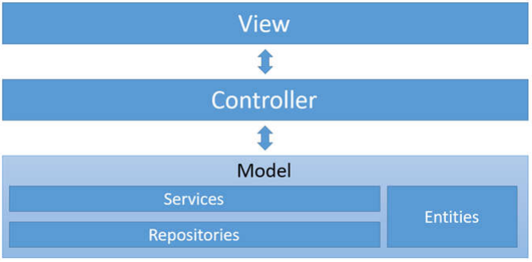
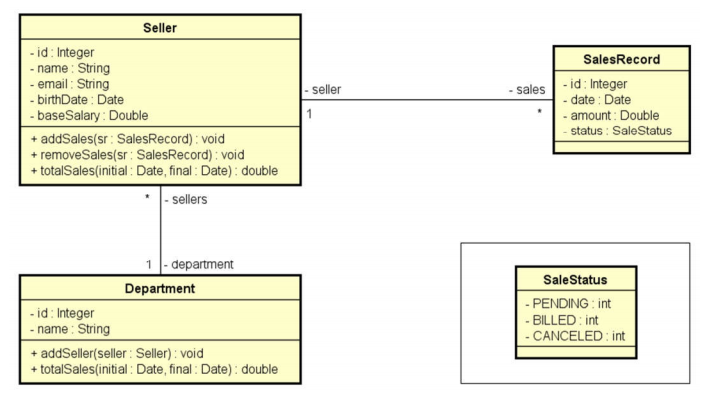
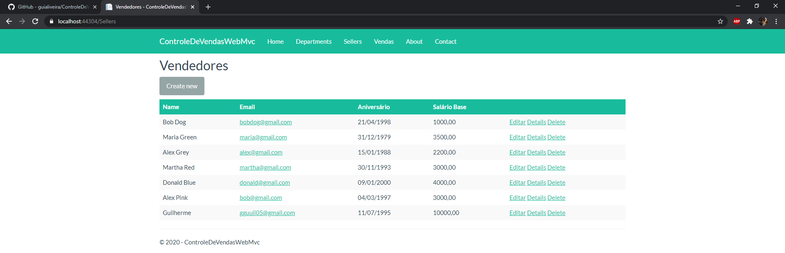
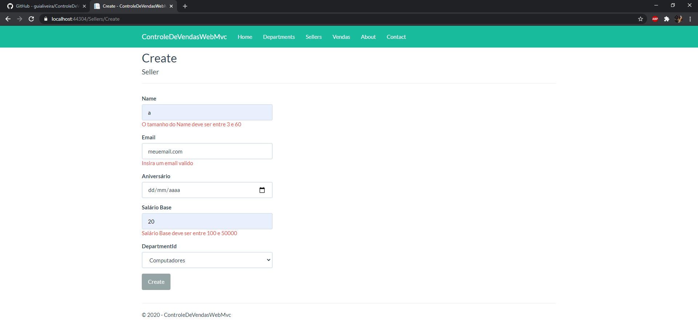
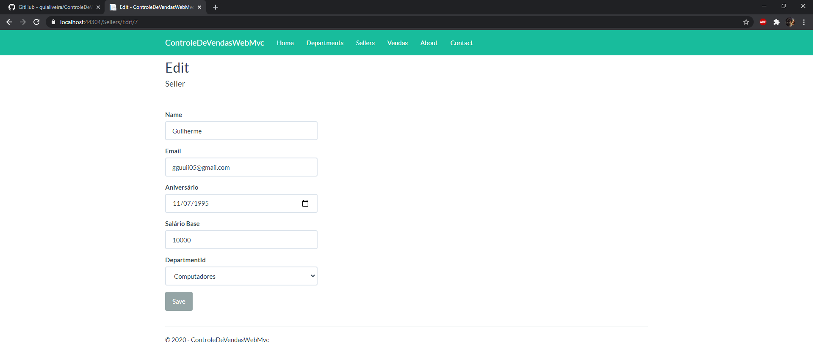
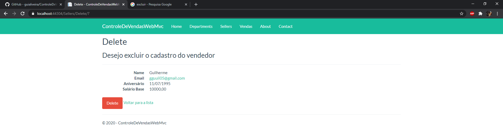
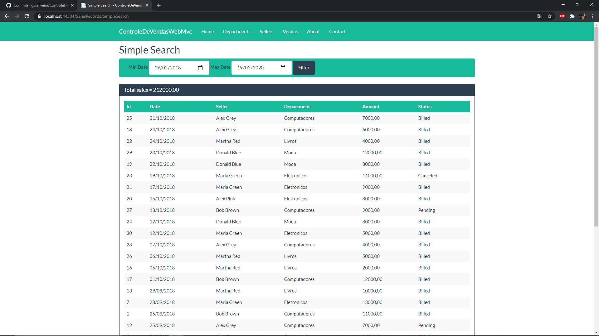
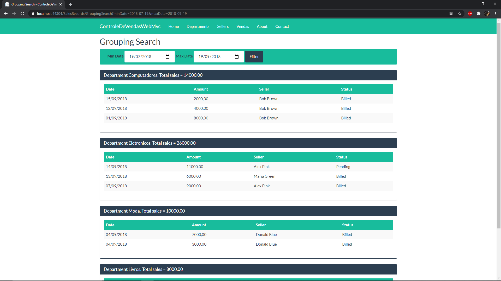

Registro de vendas Web
 
 
Arquitetura MVC:
 

  
Modelagem:
 

  
Prints:
  
  
  
  
  
  
  

Conexão DB:

    Ter o mysql instalado e configurar user:root senha:123456

    No Package Manager Console:
    o Add-Migration Initial
    o Update-Database

CSS usado www/lib/css: https://bootswatch.com/3/flatly/
