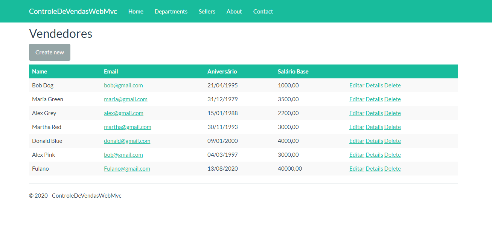

Para criar o banco:

    Ter o mysql instalado, rodando e configurar root senha 123456

    No Package Manager Console:
    o Add-Migration Initial
    o Update-Database

Style usado mudado no layout e colocando arquivo no www/lib/css = https://bootswatch.com/3/flatly/